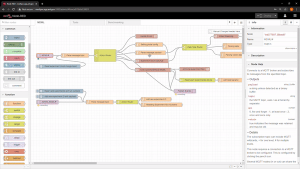
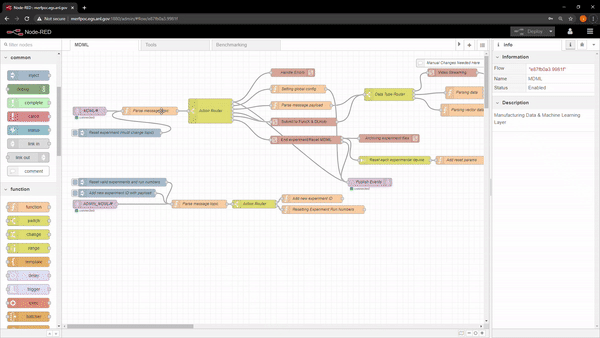
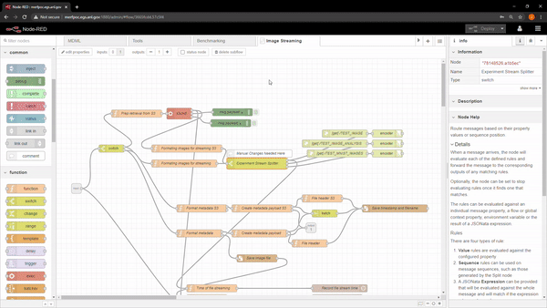

# MDML
Manufacturing Data &amp; Machine Learning Layer, Argonne National Laboratory


## Installation
```
make build_docker_images
```
The MDML runs with a docker container for each component/service. All of the docker containers can be built with the command above. Before starting the containers, certain environment variables must be set. Editting the ```set_env.sh``` file will be required to properly set admin passwords, key file locations, and more. See the [__Environment Variables__](#environment-variables) section below for details. The MDML in use at Argonne National Laboratory uses AWS' Secrets Manager to import passwords so that they are not hard coded. Passwords can be hard coded into the set_env.sh file, but AWS components and data parsing should be removed. Once the set_env.sh has been changed for your setup, run:
```
source set_env.sh
```

## Before Starting the MDML
Edit the nginx.conf file in the nginx folder. Only host names will need to be changed throughout.

## Starting the MDML
```
docker-compose up
```
Docker compose is used to start all of the docker containers used by the MDML. The first time starting the MDML you may see errors that Grafana is exiting. This is expected as Grafana's backend MySQL database is still being initialized. Once the database is ready, Grafana should no longer quit.

## Common Problems During Setup
If nginx is repeatedly failing to start, the container may not be able to find the proper keys to enable HTTPS. Grafana may also fail here for the same reason.


## Administering the MDML

### NodeRED - http://your_host:1880/admin
Before running the first experiment but after all of the docker containers have started, there is still some setup to do inside of NodeRED. NodeRED can be thought of as the brain of the MDML. It is responsible for receiving and directing all user messages through custom javascript function nodes arranged into flows. To do this, credentials must be entered to allow NodeRED to talk to the MQTT broker and InfluxDB. Below are two gifs showing how to set the credentials. Be sure that you change two MQTT servers and two InfluxDB servers with the dropdown. If usernames are not set for the server, it is "nodered" for MQTT and "admin" for InfluxDB.  

After configuring NodeRED, a user account must be created in order to use the MDML. This can be done through the home page (https://your_host_name). When a user registers, an account is created on the Mosquitto (MQTT) broker, Grafana instance, and MinIO object store. Due to the authentication in Mosquitto, the broker must be restarted to accept new user accounts attempting to send messages. This can be done by running ```docker-compose down``` (shuts down all docker containers) followed by ```docker-compose up``` (starts all docker containers). This requirement is something that we are working to remove from the MDML as it interrupts other users streaming data.

### Image stream endpoints

If there is a need to view images streamed to the MDML in real-time, an endpoint must be created by the admin in NodeRED. This endpoint sets up a Motion-JPEG stream. Image stream endpoints are added inside the __Image Streaming__ subflow. Before creating this endpoint, the experiment ID and the device ID must be known. Once inside of the __Image Streaming__ subflow, follow these steps:
1. Add a rule to the __Experiment Stream Splitter__ node of the form "== [experiment_ID]_[device_ID]"
2. Duplicate an existing HTTP endpoint and encoder node
3. Edit the HTTP endpoint node to use the new "[experiment_ID]_[device_ID]"
4. Connect the new output on the __Experiment Stream Splitter__ node to the input of the new encoder node

The gif below illustrates these steps using an experiment ID of __EXP__ and a device ID of __DEV__.


## Environment Variables

#### ALLOW_TEST
A value of "true" (default) will allow new users to run experiments under the TEST experiment ID. A value of "false" will require the user to use the experiment ID they supplied during registration.

#### AUTO_CREATE_IDS
A value of "true" will tell the MDML to automatically allow new experiment IDs that are being registered. A value of "false" (default) will stop the MDML from automatically allowing new experiment IDs (more secure). In this case, an admin of the MDML will need to add an experiment ID to the allowable experiment IDs in NodeRED. To access NodeRED, navigate to http://your_host_name:1880/admin. After logging in with the password supplied in the set_env.sh file, look for the node titled "Add new experiment ID with payload". Double click to open the node's settings. In the payload text box, enter the name of the experiment that you want to add. Click Done to close the node's settings, and then click Deploy in the upper right corner. The final step is to click the button on the left side of the "Add new experiment ID with payload" node. This injects a message into the flow with the payload you have set and adds it to the allowable experiment IDs.

#### MDML_HOST
Host name of the server running the MDML instance. This is also the address you will connect to in your browser.

#### PRIVATE_KEY_PATH & CERT_PATH
Absolute file paths to the SSL certificate and private key. Instrusctions to create self-signed SSL certificates on [Ubuntu](https://www.digitalocean.com/community/tutorials/how-to-create-a-self-signed-ssl-certificate-for-nginx-in-ubuntu-16-04) and [CentOS 7](https://www.digitalocean.com/community/tutorials/how-to-create-a-self-signed-ssl-certificate-for-nginx-on-centos-7). Self-signed certificates will work fine, but users will most likely be prompted with a security warning by their browser.

#### PASSWORDS/SECRETS
The following variables will be used as the admin password for the corresponding MDML services: MDML_INFLUXDB_SECRET, MDML_GRAFANA_SECRET, MDML_MINIO_SECRET, MDML_GRAFDB_SECRET, MDML_GRAFDB_ROOT_SECRET, MDML_NODE_RED_PASS. The remaining password variable, MDML_NODE_MQTT_USER, is the password used by NodeRED to connect to the MQTT broker. 


## Funding
MDML was created under the Manufacturing Science and Engineering Initiative at Argonne National Laboratory. Argonne National Laboratory's work was supported by the U.S. Department of Energy, Office of Science, under contract DE-AC02-06CH11357.